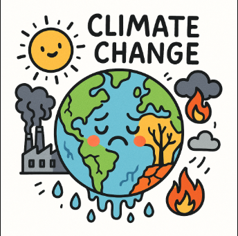

# Environmental Impact Storytelling Cards

This ancient legacy application has been dug up and needs to be deployed again as a customer is interested in using it for their internal climate awareness programme.

## Some guidance

- It's a bit on the old side and can't handle much load, we're expected to have it serve people around the world.
- The customer is a big supermarket and has been hacked recently so their sensitive about security

## Your mission

Is to pair with us and work on the following tasks, ask questions as you go along and describe what you're doing and more importantly **why**

> Correct thinking is more important than the correct answer.

We want to know and understand your thought processes and how you'll work with us and we'll work with you.  We'd rather have the "wrong" answer explained perfectly than the "correct" answer with no justification.

### Core tasks

You may **not** use LLM assistance for this section.

- [ ] Fork and Clone the project, commit your work
- [ ] Get it running locally
- [ ] Get it working with latest NodeJS
- [ ] Anything else we should do to the project to:
  - [ ] make the customer feel at ease
  - [ ] make it less 'legacy' and easier to work on

### Stretch Tasks

You **may** use LLM assistance for this section.

- [ ] Write a Docker compose file to spin this up
- [ ] What else could we add to the compose file to make it more robust ?
- [ ] Write some Github Actions manifest to build the container and publish it to a suitable container repository
- [ ] Write some IAC (pseudocde is fine) to setup this application and deploy it to AWS
  - [ ] Pick your deployment workflow and justify it
  - [ ] Pick your platforms and justify them
  - [ ] We want to add a data store to save people's answers, what should we use and why - Please draw a diagram
- [ ] How do we guarantee that it's going to support the load we need?
